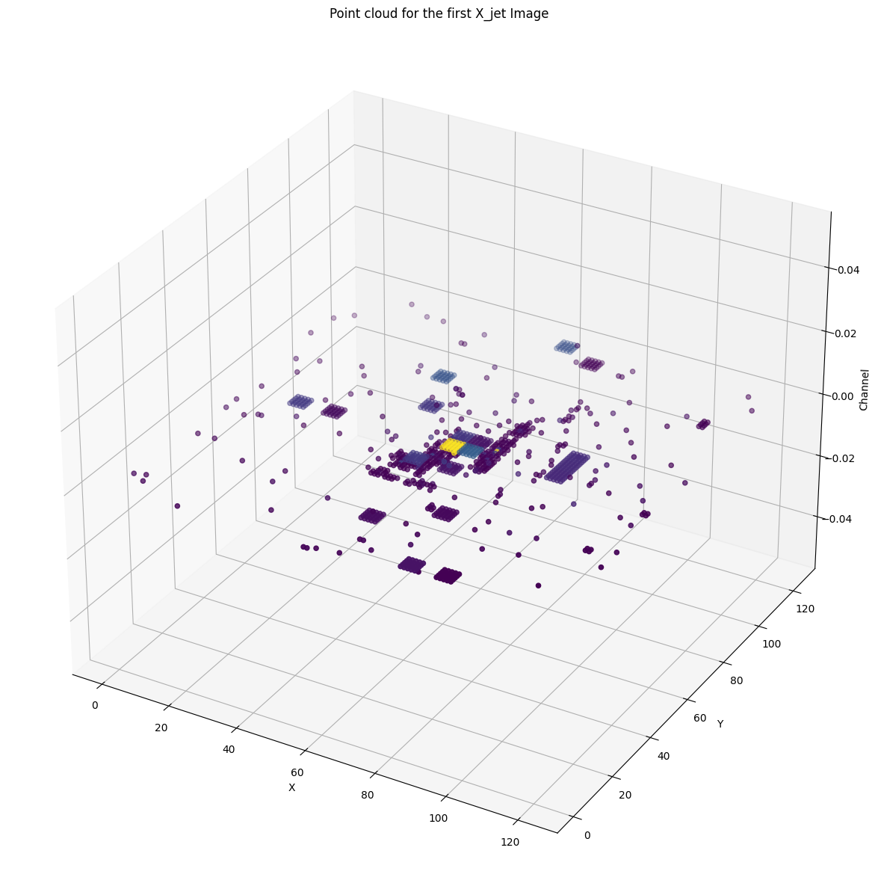

# ML4SCI GSOC GENIE Task
## Common Task 2. Jets as graphs 
Jet Images are not our typical RGB images as the three channels(Track, ECAL and HCAL) represent raw sensor data. Classification between the quark and gluon cannot be done using our typical Image Classification algorithms. The provided literature suggests converting the images to point cloud format which will better represent the relation between each point cloud. This point cloud can be represented as graphs that can capture the relation between individual nodes using edges thus providing a better understanding of the data. Training classification models based on Graph Neural Networks on this dataset will provide us with a much better result compared to traditional ways.

## Task
1. Choose a graph-based GNN model of your choice to classify (quark/gluon) jets. Proceed as follows:
   - Convert the images into a point cloud dataset by only considering the non-zero pixels for every event.
   - Cast the point cloud data into a graph representation by coming up with suitable representations for nodes and edges.
   - Train your model on the obtained graph representations of the jet events.
2. Discuss the resulting performance of the chosen architecture.

## Training 
The data set was trained on three different architectures, among which one was finally selected, with the same parameters:
```
Learning Rate: 0.001
Optimizer: Adam
Loss: Cross Entropy loss
Epochs: 30
```
## Results
### Point Cloud Result
The following is a sample of the point cloud representation of the image: 


### Classification Result

Model  | Test Accuracy 
------------- | ------------- 
GCN  | 68.8%
GAT | 67%
GraphSAGE | 69.9% 
### Normalized Result
Also, I tried normalizing the Jets and training them on the Graph SAGE-based architecture.

Data  | Test Accuracy 
------------- | ------------- 
Non-normalized  | 69.9%
Normalized | 68.2%


## Discussion
The **final architecture** chosen here is the **Graph Sage** architecture.

- Firstly, among all three architectures we experimented on Graph Sage performed just slightly better.

- From a computational point of view Graph Sage is much more efficient than the other two architectures as it samples and aggregates the features of neighbors of a node. 

- Although the performance between the models is more or less the same here, it can change when we use large batches or use a bigger subset of data, or tune the - hyperparameter.

- I tried using global_mean_pool to aggregate the node features and provide a global graph vector but there are more efficient methods to do that such as using mincut pooling and more.

- Also normalizing the jets didn't improve anything. This may be because the Jets are raw sensor data in physical space and as such standard preprocessing may not be the same here as it is for an RGB image.
